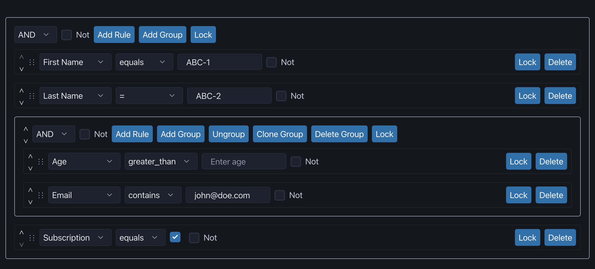

# SolidJS Query Builder

## Query Builder is an UI component to create complex queries and filters

### Supported features out of the box



- Customizable: Query Builder with default options that can be customized.
- Nested Groups and Rules: Supports creating nested groups and rules.
- Operations: Add, clone, delete, shift, and more operations on rules and groups.
- Styling: Tweak default styles or provide custom styles for the Query Builder.
- JSON Output: Outputs structured JSON of rules and groups for creating complex queries.
- Accessibility: Keyboard navigation and screen reader support.
- Drag and Drop: Reorder groups and rules with drag and drop support.
- Custom Operators and Editors: Supports custom operators and value editors.

## Quick start

Install it:

```bash
npm install @query-builder/solid-query-builder;
# or
yarn add @query-builder/solid-query-builder;
# or
pnpm add @query-builder/solid-query-builder;
```

Use it:

```tsx
import { QueryBuilder } from '@query-builder/solid-query-builder';

// optional import for default minimal styling
import '@query-builder/solid-query-builder/dist/index.css'
```

## Documentation & Demo

<https://query-builder.github.io/solid-query-builder/>

## Basic Usage

```tsx
<QueryBuilder
  initialQuery={QUERY_DATA}
  fields={FIELDSDATA}
  operators={OPERATORS_DATA}
  showShiftActions
  allowDragAndDrop
  disabled={false}
  addSingleRuleToGroup={false}
  showNotToggle="both"
/>
```

### Query Data

```tsx
{
  id: uuidv4(),
  combinator: 'OR',
  rules: [
    {
      id: uuidv4(),
      field: 'First Name',
      fieldValue: 'ABC-1',
      operator: '=',
    },
    {
      id: uuidv4(),
      field: 'Last Name',
      fieldValue: 'ABC-2',
      operator: '=',
    },
    {
      id: uuidv4(),
      combinator: 'OR',
      rules: [
        {
          id: uuidv4(),
          field: 'Age',
          fieldValue: 'ABC-3',
          operator: '=',
        },
        {
          id: uuidv4(),
          field: 'Email',
          fieldValue: 'john@doe.com',
          operator: '=',
        },
      ],
    },
    {
      id: uuidv4(),
      field: 'Subscription',
      fieldValue: 'ABC-4',
      operator: '=',
    },
  ],
};
```

### Fields Data

```tsx
[
  {
    name: 'First Name',
    label: 'First Name',
    placeholder: 'Enter first name',
    id: '1',
    operators: [
      { name: 'equals', value: 'equals', label: 'Equals' },
      { name: 'between', value: 'between', label: 'Between' },
    ],
    valueEditorType: 'text',
    inputType: 'text',
    values: [{ value: 'John', label: 'John' }],
    defaultOperator: 'equals',
    defaultValue: 'John',
    comparator: 'string',
  },
  {
    name: 'Last Name',
    label: 'Last Name',
    placeholder: 'Enter last name',
    id: '2',
    valueEditorType: 'text',
    inputType: 'text',
    values: [{ value: 'Doe', label: 'Doe' }],
    defaultOperator: 'equals',
    defaultValue: 'Doe',
    comparator: 'string',
  },
  {
    name: 'Age',
    label: 'Age',
    placeholder: 'Enter age',
    id: '3',
    operators: [{ name: 'greater_than', value: 'greater_than', label: 'Greater Than' }],
    valueEditorType: 'text',
    inputType: 'number',
    values: [{ value: '30', label: '30' }],
    defaultOperator: 'greater_than',
    defaultValue: 30,
    comparator: 'number',
  },
  {
    name: 'Email',
    label: 'Email',
    placeholder: 'Enter email address',
    id: '4',
    operators: [{ name: 'contains', value: 'contains', label: 'Contains' }],
    valueEditorType: 'text',
    inputType: 'email',
    values: [{ value: 'example@example.com', label: 'example@example.com' }],
    defaultOperator: 'contains',
    defaultValue: 'example@example.com',
    comparator: 'string',
  },
  {
    name: 'Subscription',
    label: 'Subscribed to Newsletter',
    id: '5',
    operators: [{ name: 'equals', value: 'equals', label: 'Equals' }],
    valueEditorType: 'checkbox',
    inputType: 'checkbox',
    values: [{ value: 'true', label: 'Yes' }],
    defaultOperator: 'equals',
    defaultValue: true,
    comparator: 'boolean',
  },
]
```

### Operators Data

```tsx
[
  { name: '=', value: '=', label: '=' },
  { name: '!=', value: '!=', label: '!=' },
  { name: '<', value: '<', label: '<' },
  { name: '>', value: '>', label: '>' },
  { name: '<=', value: '<=', label: '<=' },
  { name: '>=', value: '>=', label: '>=' },
  { name: 'contains', value: 'contains', label: 'contains' },
  { name: 'beginsWith', value: 'beginsWith', label: 'begins with' },
]
```
